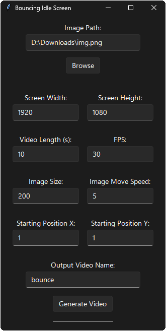

This Python program uses an image to create a classic DVD logo idle screen.

  

The program is not too in depth, so it currently does not support audio and can only do square images.

Note that the larger you make the file, the longer it will take to process. So increasing screen width and height, video length, and frames per second (FPS) will create a larger file.

  <video src="./Idle_Bounce.mp4" controls muted loop width="640" height="360"></video>

